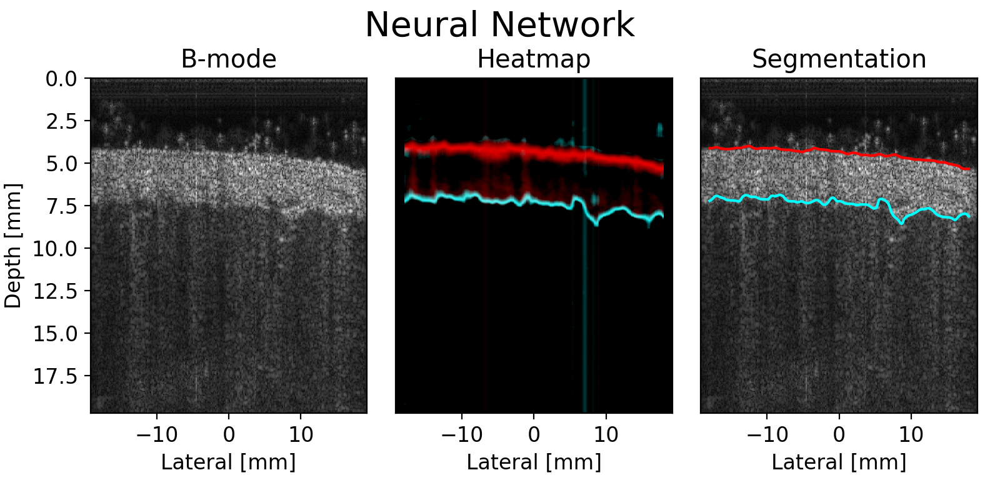

[](https://zenodo.org/badge/latestdoi/228273905)
[](https://travis-ci.org/fqjin/skin-segmentation)
[](https://codecov.io/gh/fqjin/skin-segmentation)
[](https://opensource.org/licenses/Apache-2.0)

## Ultrasound Skin Segmentation
Two methods for segmenting skin on ultrasound B-mode images

<p>


</p>

## Try out the methods:
#### [Google Colab notebook](https://colab.research.google.com/drive/1LucoMbMLKTz-mhcLrTGTWd_7D6peyqV7)
#### [Jupyter notebook](Example.ipynb)

## Citation
Please cite the following publication:
```
@article{jin2021semi,
  title={Semi-automated weak annotation for deep neural network skin thickness measurement},
  author={Jin, Felix Q and Knight, Anna E and Cardones, Adela R and Nightingale, Kathryn R and Palmeri, Mark L},
  journal={Ultrasonic Imaging},
  volume={43},
  number={4},
  pages={167-174},
  year={2021},
  publisher={SAGE Publications Sage CA: Los Angeles, CA},
  doi={10.1177/01617346211014138},
  note={PMID: 33971769}
}
```

## Acknowledgements
This work was supported by the National Institutes of Health (R01 EB002132, R42 CA228159, T32 GM007171).

We were also supported by the Duke Skin Disease Research Center, Dermatology Foundation and Pinnell Center for Investigative Dermatology Translational and Innovative Research Support Program.

We received in-kind support from Siemens Healthineers, USA, Ultrasound Division.
